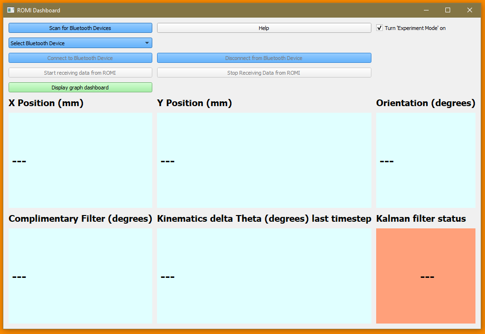

# Arduino_Romi_Dashboard

## Contents

- Purpose
- Installation
- Instructions for use

# Purpose

This dashboard displays and records the realtime position of a robot (we used the Arduino 'Romi'). It uses pyqt and pyqtgraph as a Graphical User Interface (GUI). It displays and records:

- Cartesian X position (mm)
- Cartesian Y position (mm)
- Orientation (degrees)
- Orientation [Using kalman filter] (degrees)
- Kalman Status (on/off)

This dashboard takes a serial data written from the arduino robot as a bytes object in the form:

"Time(s),PositionX,PositionY,Orientation(deg),compFilter(deg),deltaTheta(deg),kalmanStatus(boolean)\n"

The Romi dashboard displays the data in realtime.

The program saves raw data to a file named "out.csv" and saves formatted data to "outformatted.csv" in the root directory. Data can also be exported by right clicking on graphs

The program is written to help return experimental results for the Romi robot as part of a university course.

# Can I see a video of it  in action?

Yes ! here:

<a href="http://www.youtube.com/watch?feature=player_embedded&v=QUWGgHYCovE
" target="_blank"></a>

# Can I see a screenshot of the program?

Sure! Here:

(*Note to see full size images click on image!*) 

| Main screen     | Graph interface (pyqtgraph)      | Realtime data      |
|------------|-------------|-------------|
|  |  |  |


# Installation

The dashboard runs from a single python script. It has been tested on Windows and Linux. Most of its dependancies are bundled in the standard Anaconda python distribution. These instructions assume you have already installed the standard python Anaconda distribution. Follow these steps to install and run the python script.

*[Note: Skip steps 1 & 2 if you already installed and ran opencv in windows using visual studio (e.g. as part of MSc Robotics course)!]*

1. Download and run "Visual Studio Installer": [https://www.visualstudio.com/pl/thank-you-downloading-visual-studio/?sku=BuildTools&rel=15](https://www.visualstudio.com/pl/thank-you-downloading-visual-studio/?sku=BuildTools&rel=15)

2. Install "Visual Studio Build Tools 2017", check "Visual C++ build tools" and "Universal Windows Platform build tools" (Approx 13 GB).

3. Open'Anaconda Prompt' (from the start menu in windows). Run the following commands to install the additional dependancies
   
``` bash
    pip install PyBluez-win10
    pip install pyserial
    conda install -c anaconda pyqtgraph
```

1. Add the HC-05 bluetooth module to 'bluetooth & other devices' in windows settings with the password '1234'. Complete this step by searching for 'bluetooth & other devices' in the start menu.
   
2. Clone the 'Arduino_Romi_Dashboard' code repository (or download zip file) from github and save somewhere on your computer

3. Open vscode (or another editor). I recommend to launch this editor from Anaconda Navigator.
   1. Navigate to the 'Arduino_Romi_Dashboard' directory and open the python script
   2. Run the python script from the code editor (in vscode right click -> Run python file in terminal)


# Instructions for use

The program needs to connect to an arduino (or other microcontroller) module which is attached to a bluetooth module (e.g. HC-05) and transmitting serial data over bluetooth.

This is tested with a HC-05 module writing serial data (serial1.print()).

To get started with the program

1. Run the python script as described in **instructions**
2. **Click** -> Search for bluetooth devices
3. Click --> **Connect** to bluetooth devices
4. Click --> **Start receiving data from ROMI**
